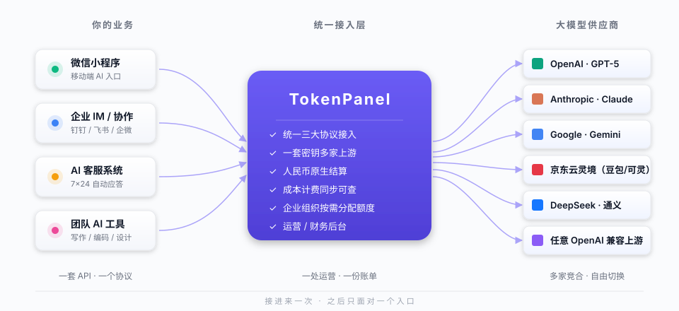

# TokenPanel

**让多家大模型，像一家一样使用。**

---

## 我们解决什么问题

今天，任何想认真用大模型的团队都会陷入同一个困局：

- 每个供应商一套 API、一套计费、一套额度，财务月底对账靠人肉拼表。
- 一旦某家上游限速、宕机、涨价，整个业务被绑架，迁移成本是重写。
- 国内外模型混用——海外要 Claude / GPT，国内要豆包 / 可灵 / DeepSeek——前端代码、SDK、密钥分散在十处。
- 团队里谁在用什么、花了多少、问了什么，没有人说得清。

TokenPanel 是一层放在你的业务和所有大模型供应商之间的「统一接入与运营平台」。

接进来一次，之后你的研发只面对**一个 API 协议、一套密钥、一份账单、一个后台**，而背后是几十家可以随时切换的上游。

---

## 一个画面看懂它



---

## 三件事，我们做得比同行更好

### 一、协议自由

客户的开发者用 OpenAI SDK 写好的代码，**不改一行**，就能调到 Claude、Gemini、豆包、任何 OpenAI 兼容的国产模型上。反过来也成立——用 Anthropic SDK 也能打到 OpenAI 账号。

这意味着：
- 团队的代码不被任何一家供应商绑定。
- 上游议价空间彻底打开：哪家便宜用哪家、哪家稳用哪家。
- 新模型上线，运营在后台勾一下就能让全公司用上。

### 二、一份账，财务能看懂

每一笔调用，我们都同时记录三个数字：上游真实成本、对客户的计费、毛利。

- **人民币原生结算**：实时汇率、模型折扣、按 token 或按秒（视频生成）两种计费单位，财务月结一张表就够。
- **客户自带订单号反查**：客户的工单系统用自己的订单号，就能反查到 TokenPanel 这边的每一笔账单——彻底告别"对不上账"的客诉。
- **毛利逐请求可拆解**：哪个模型在亏钱、哪个用户最赚钱、哪天该提价，数据说话。

### 三、运营一眼看穿

后台不是技术日志的堆放地，而是给运营和老板看的：

- **词云**：用户上周到底在问什么？AI 客服、代码助手、还是写小说？决定下一步该接哪家模型。
- **用量画像**：每个用户、每个 API Key、每个分组的消耗趋势，谁在烧钱一目了然。
- **风险预警**：余额不足、配额超限、上游异常，多通道告警自动派单。
- **审计完整**：操作日志带客户端 IP、API Key 名称、上游来源，事后追责有据可查。

---

## 功能详解

下面把六个模块的能力逐项展开，每一条都说清"你的团队能做什么动作、最终拿到什么结果"。

### 一、协议接入与上游聚合

**1. 三大主流协议同时入口。** 同一台 TokenPanel 同时对外暴露三套协议：
- OpenAI 风格 `/v1/chat/completions`、`/v1/responses`、`/v1/embeddings`、`/v1/images/generations`
- Anthropic 风格 `/v1/messages`
- Google Gemini 风格 `/v1beta/models/{model}:generateContent`、`:streamGenerateContent`

客户的研发**用哪家 SDK 都行**，TokenPanel 在中间自动翻译。

**2. N×M 协议双向桥接。** 比如你后台只买了 Claude 账号，但客户用的是 OpenAI SDK——TokenPanel 会把 `chat/completions` 请求翻译成 Anthropic Messages 调上游，再把流式响应翻译回 OpenAI SSE 格式。**整个过程不落地、不丢字**。已实现的桥接方向：

| 入站 | 出站可选 |
|---|---|
| OpenAI Chat Completions | OpenAI / Anthropic / Gemini |
| OpenAI Responses | OpenAI / Anthropic |
| Anthropic Messages | Anthropic / OpenAI |
| Gemini v1beta | Gemini / OpenAI / Anthropic |

**3. 上游账号池。** 同一家上游可挂多个账号轮转使用：
- **健康度评分**：账号被上游限速 / 报错时自动降权，恢复后自动升权。
- **Sticky Session（Claude 专属）**：同一对话 1 小时内固定到同一账号，保证上下文连贯。
- **并发等待队列**：高并发场景账号忙时排队而不是直接拒绝，最大化每个账号的吞吐。
- **故障转移**：单账号宕机自动切下一家，业务无感。

**4. Generic 通用渠道。** 当你接入的是 newapi、万界方舟、硅基流动等"中转平台"时，一个账号可以挂多个不同协议的端点（一个走 OpenAI、一个走 Anthropic、一个走 Gemini），按入站协议自动选端点。**不用为每个协议开一个账号**。

**5. 已接入的上游清单**：
- **海外**：OpenAI（含 Codex、Responses）、Anthropic Claude、Google Gemini、Vertex AI、AWS Bedrock（含 Claude Code 兼容层）、Antigravity
- **国内**：京东云灵境（豆包 / 可灵 / 海螺 / Vidu / 拍我 / Happy_Horse / 数字人 共 26 个视频图像模型）、火山引擎、阿里通义、腾讯混元、DeepSeek、硅基流动
- **通用**：任何 OpenAI / Anthropic / Gemini 兼容的第三方上游

---

### 二、计费与对账

**1. 一张表管所有模型定价。** 后台的「模型定价」页是全站计费唯一真源。每条记录支持：
- **基础单价**：input / output / cache_creation / cache_read 四档 token 价格
- **折扣率**：例如给 VIP 用户的 Claude Opus 4 打 7 折
- **计费单位**：按 token（聊天模型）或按秒（视频生成模型）
- **可见性**：是否允许用户在「模型广场」看到
- **启用状态**：临时下架某模型一键完成

**2. 从上游一键导入。** 接了新上游后，填写 Base URL + API Key + Provider 名称，点击"从上游导入"，TokenPanel 会调上游 `/v1/models` 把所有可用模型批量写入定价表。**只插新模型、不覆盖已有价格**——你之前调好的折扣不丢。

**3. 人民币原生结算。** 全局可配置 `1 USD = X CNY` 实时汇率，用户端看到的价格直接是人民币。也可切换为美元显示模式。

**4. 三个数字同步落库。** 每一笔成功调用，`usage_log` 表同时记录：
- **客户计费**：按你给的价格算出来的应收金额
- **上游成本**：调用上游花的真实美元成本（按上游官方刊例价反算）
- **毛利**：客户计费 − 上游成本

**5. Bill-Request-ID 对账闭环。** 客户在调用 API 时附带请求头：
```
Bill-Request-ID: ORDER-2026-0605-12345
```
TokenPanel 会：① 把这个值原样回写到响应头；② 落库到 `usage_logs.bill_request_id`；③ 提供 `GET /api/v1/usage?bill_request_id=ORDER-2026-0605-12345` 精确反查接口。

**好处**：客户的工单系统记着自己的订单号，发生争议时一查就知道对应的 token 消耗、上游、时间、成本，再也不用让客户提供"那个奇怪的 chatcmpl-xxx ID"。

**6. 卡密兑换。** 后台批量生成兑换码（一次生成 N 张、面额可指定、过期时间可设），适合：
- 节假日促销发卡
- 渠道代理批量进货
- 内部员工福利
- 试用换激活

**7. Affiliate 推广分润。** 内置二级推广系统：
- 用户拿到自己的推广链接 / 推广码
- 被推广用户充值时，推广人按比例获得分润
- 分润可转为账户余额或直接提现
- 后台可看每个推广人的拉新 / 转化 / 留存数据

**8. 多支付渠道工厂。** 内置 5 家支付商：
| 支付商 | 主用场景 |
|---|---|
| 支付宝 | 国内 C 端、个人开发者 |
| 微信支付 | 国内 C 端、扫码场景 |
| Stripe | 海外 / B 端订阅 |
| Airwallex | 出海多币种结算 |
| EasyPay | 国内聚合支付备份 |

后台支持按"负载均衡策略"分发支付请求——比如把 70% 流量给 Stripe、30% 给 Airwallex，单家费率涨了立刻调比例。

**9. Webhook 退款流程。** 内置支付回调验签、订单状态机、自动对账、人工退款审批流。

---

### 三、账号与权限

**1. 多种登录方式同时开**：
- **邮箱 + 密码**（支持邮箱验证码注册）
- **邮箱 + 验证码**（无密码登录）
- **手机号 + 短信验证码**
- **手机号 + 密码**
- **OAuth**：GitHub、Google
- **企业 SSO**：钉钉、企业微信、LinuxDo、OIDC（适配 Authentik / Keycloak 等）

每种方式可在管理员后台**独立开关**——例如只允许企业 SSO 注册，禁掉密码登录。

**2. 短信服务商三家任选。** 火山引擎、腾讯云、阿里云三家短信服务后台一键切换。同一份模板，哪家费率好用哪家、哪家额度足用哪家。

**3. TOTP 双因素认证。** 用户可在个人中心开启 Google Authenticator / 1Password 等 TOTP 工具，登录时需输入 6 位动态码。管理员可强制特定角色必须开启。

**4. 三级配额体系**：

| 层级 | 控制内容 | 典型用法 |
|---|---|---|
| 用户 | 总余额 USD、并发数上限、是否启用 | "给老王充 200 美元、最多 10 并发" |
| 分组 | 可用上游账号、可用模型白名单、专属折扣率、限速 | "VIP 组用 Claude Opus + Gemini Pro，普通组用 Haiku" |
| API Key | USD 配额上限、5h/1d/7d 三档限速、IP 白名单/黑名单、过期时间 | "测试 Key 只能跑 5 美元、只能从 CI 服务器 IP 调" |

三层独立，任一层先触顶就拒绝。

**5. API Key 多维度限速。** 单个 Key 可同时设置三个时间窗口的金额上限（5 小时 / 1 天 / 7 天 USD），任一窗口触顶即拒绝新请求。**比单纯 RPM 限速更贴近真实业务诉求**（控制金额比控制请求数对运营有意义）。

**6. IP 白/黑名单。** 单 Key 级别配置：
- 白名单 `["192.168.1.0/24", "203.0.113.50"]`：只允许这些 IP 调用
- 黑名单：拒绝指定 IP，配合上游侧的国家/地区封禁策略

**7. 会话回收。** 管理员可主动让某用户在所有设备登出（密钥泄漏、离职等场景）。

**8. 操作日志带客户端 IP + API Key 名称。** 每一条管理员操作（改配额、删用户、改密钥）都记录是谁、什么时间、从哪个 IP、影响了哪个对象，事后追责有据可查。

---

### 四、运营与可观测

**1. 词云分析（Prompt Analytics）。** 后台中间件实时从网关请求体中提取关键词，按用户 / 按月聚合：
- 月度词云图，一眼看出本月用户在问什么主题
- Top-N 关键词排行，可按用户筛选
- 适合判断"该接哪家模型"、"该做哪个垂直应用"

**2. 用户用量画像。** 单用户详情页提供：
- 累计 / 当日请求数、token 数、消费金额
- 按平台拆分（哪部分花在 Claude、哪部分在豆包）
- 按模型拆分的 Top-N
- 按端点拆分（哪些上游账号被频繁调用）
- 日趋势曲线（最近 30 天）

**3. 实时仪表盘。**
- 当前在线用户数、QPS、TPM（每分钟 token 数）
- 各上游账号当前健康度评分
- 错误分布饼图（限速 / 余额 / 上游 5xx / 其它）
- 延迟分布直方图（P50 / P95 / P99）

**4. 模型 Top-N 与趋势。** 全局 / 按分组 / 按时间窗口的模型调用排行，配合趋势曲线判断模型生命周期。

**5. 多通道告警。**
- **触发场景**：用户余额低于阈值（绝对值或百分比可选）、API Key 配额耗尽、上游账号连续失败 N 次、月消费突增异常
- **通知方式**：邮件、站内消息、Webhook（可对接钉钉 / 企微 / 飞书机器人）
- **抑制策略**：相同告警 X 分钟内只发一次，避免轰炸

**6. 错误日志带完整上下文。** 出错时不只是看到一行错误码，还能展开看：
- 客户端 IP / API Key 名称 / 用户邮箱
- 上游账号 / 上游 endpoint / 上游 request_id
- 请求 body / 响应 body 摘要
- 调用栈关键位置

排查问题不用问客户"你刚才请求 ID 是啥"，自己后台查就行。

**7. 内容审计与关键词拦截。** 后台可配置关键词黑名单，命中时拒绝转发上游（适合合规要求严格的场景）；哈希缓存让二次命中的判定走 Redis，性能无感。

---

### 五、管理后台

**1. 上游账号管理。**
- 按平台分组列表（OpenAI / Anthropic / Gemini / 灵境 / Generic ...）
- 单账号配置：密钥、Base URL、模型白名单 / 映射、并发上限、是否启用响应遮蔽
- 批量操作：批量启用 / 禁用、批量改分组、批量改并发上限
- 账号测试：一键发测试请求验证密钥有效性，灵境视频模型自动用中文 prompt + 8min 长超时
- 健康度与统计：每个账号的当日 / 累计调用数、成功率、平均延迟

**2. 用户管理。**
- 列表筛选：按邮箱 / 手机号 / 用户名 / 状态 / 余额区间 / 注册时间
- 单用户操作：调整余额、强制下线、改分组、改并发上限、改密码、改备注
- 批量充值：批量给一组用户加余额（活动 / 补偿场景）
- 用户用量统计：进入单用户的完整画像页

**3. 模型定价管理。**
- "只显示可见模型"过滤（默认勾选）：只看至少有一个账号挂载的模型
- 按 Provider 筛选 / 按启用状态筛选 / 按是否定价筛选
- 单模型编辑：input / output 单价、折扣率、计费单位、长上下文阈值与倍率
- "从上游导入"：填 Base URL + Key 一键拉模型表
- 批量启用 / 禁用：临时下架某 Provider 的所有模型

**4. 模型广场（用户端）。** 用户登录后看到的模型列表：
- 只显示他当前 API Key 实际能用的模型（按账号白名单过滤）
- 显示原价 → 折后价 → 人民币价
- 显示折扣标签（"7 折"、"限时 6 折"）
- 图片 / 视频模型单独分类
- 一键复制模型名到剪贴板

**5. 公告系统。**
- 分级（普通 / 重要 / 紧急），分推送渠道（站内信 / 邮件 / 登录页弹窗）
- 已读追踪：每个用户哪些公告读了一目了然
- 定时发布 / 自动失效

**6. UI 主题。** 内置三套主题（teal / violet / orange），后台一键切换；i18n 内置中英文，新语种可加。

**7. 设置中心。** 站点名、Logo、技术支持邮箱、Turnstile 验证码、注册开关、邀请码模式、初始余额、初始并发、密码强度策略、登录方式开关、SSO 配置、SMS 服务商配置、支付渠道配置、模型折扣全局表 —— 全部后台改，**不需要重启服务**。

---

### 六、部署与运维

**1. 私有化部署，三档配方**：

| 形态 | 适用规模 | 资源建议 |
|---|---|---|
| 单机 Docker Compose | ≤ 50 用户 / ≤ 100 万 token 日 | 4C8G VM × 1 |
| 集群多副本 | ≤ 1 万用户 / 1k QPS | 后端 8C16G × 3 + PG + Redis Sentinel |
| 国产化内网 | 政企 / 科研 | 金仓/达梦 + 麒麟/UOS，离线镜像导入 |

**2. 单二进制嵌入前端。** `go build -tags embed` 产出一个 ~50 MB 的二进制文件，前端静态资源全部嵌入。部署只要：PostgreSQL + Redis + 这个文件。**没有 Node 进程、没有 Nginx 必需**。

**3. AUTO_SETUP 静默初始化。** 首次启动通过环境变量传管理员账号、初始密码、域名等，零交互完成数据库迁移和初始化。适合 Helm / Ansible / Terraform 自动化部署。

**4. Simple 模式（个人 / 试用）。** `RUN_MODE=simple` 关闭计费校验和配额检查，适合：
- 个人开发者本地用
- 团队小规模试点（不需要先配价格表）
- 教学 / 演示场景

**5. 回滚开关全覆盖。** 高风险特性都有 feature flag，配置一改立刻生效，**不需要重新部署**：
- `USAGE_UPSTREAM_COST_ENABLED`：上游成本快照开关
- `PROTOCOL_BUCKET_ENABLED`：协议感知调度开关
- `GATEWAY_SCHEDULING_GENERIC_RUNTIME_ENABLED`：Generic 通用渠道运行时开关
- `PHONE_REGISTER_ENABLED`：手机号注册开关
- `PASSWORD_LOGIN_ENABLED`：密码登录开关

出问题时秒级回退，不需要紧急停机。

**6. H2C 与 HTTP/2 优化。** 网关转发支持 HTTP/2 Cleartext，帧大小 / buffer 可调，高并发场景下显著降低连接开销。

**7. Redis Singleflight 缓存。** 用户组限速等热点查询用 singleflight 模式合并并发请求，防止缓存击穿。

**8. 优雅关闭。** SIGTERM 触发时，后台所有 goroutine（定时报告、清理、告警评估、Token 刷新、OAuth poll、灵境视频轮询）并行收敛，正在处理的请求等待最长 30 秒完成。**滚动升级不丢请求**。

**9. 数据库迁移自动执行。** 升级新版本时自动检测并执行新增的 SQL 迁移，无需手动操作。所有迁移幂等可重入。

**10. 备份与恢复。** 内置 `pg_dump` 调度备份 + S3 上传脚本，配合标准 Postgres 恢复流程。

---

## 客户用它做什么

### 场景 A：AI 服务转售

**典型客户**：把 GPT-5、Claude、可灵视频打包卖给中小企业的渠道商。

**他们用 TokenPanel 做到**：
- 后台一键导入上游模型定价，按自己的折扣率定价转售。
- 用户用支付宝 / 微信 / Stripe / Airwallex 自助充值，账户自动到账。
- 配卡密、配推广分润，新客拉新有抓手。
- 月底导出毛利报表，知道每个客户、每个模型赚多少。

### 场景 B：企业 AI 中台

**典型客户**：一家有几百员工的公司，想给所有部门发 AI 配额。

**他们用 TokenPanel 做到**：
- 钉钉 / 企微 / OIDC 单点登录，HR 入职即开通。
- 按部门、按角色发配额，研发 1000 美元、市场 200 美元、新员工先给 50 美元试用。
- 单 Key 限速、IP 白名单、双因素认证，避免密钥泄漏导致费用爆炸。
- 国产化部署——金仓 / 达梦 / 麒麟 OS 都能跑，数据全程不出内网。

### 场景 C：MaaS 平台 / 团队工具

**典型客户**：一支 5-20 人的小团队，做 AI 写作 / 代码助手 / 客服机器人。

**他们用 TokenPanel 做到**：
- 同一个团队 Key 让所有应用共用额度，再也不用为每个项目开订阅。
- 上游冗余：Claude 偶尔抽风，自动切到 GPT 同等模型，业务无感。
- 用量数据沉淀下来，下次融资 / 述职时数据图表现成。

---

## 关键差异化能力

| 别家有 | TokenPanel 多一层 |
|---|---|
| OpenAI 兼容代理 | OpenAI ⇄ Anthropic ⇄ Gemini ⇄ Responses **全协议双向桥**，流式不丢字 |
| 记录调用日志 | 同时落库**上游成本**，毛利率逐请求可查 |
| 自己的 request_id | **下游订单号原样回写并落库**，客户用自己的 ID 反查账单 |
| 海外大模型代理 | **京东云灵境深度接入**：可灵视频、豆包 Seedream、海螺、Vidu、拍我等 26 个视频图像模型，刊例价已落库 |
| 内置发送邮件 | **三家短信即插即用**（火山 / 腾讯 / 阿里），合规渠道任选 |
| 一刀切定价表 | 计费单位区分**按 token / 按秒**，视频生成场景毛利不再算错 |
| 灰度靠重新部署 | 每个高风险特性都有**开关**，30 秒回滚不需停机 |

---

## 接入路径

**第一周：试点**
内网部署样机，接 1-2 个上游账号，灰度 50 个内部用户跑一周。
我们提供 Docker Compose 模板，半天起服务。

**第二周：联调**
导入定价表、配置支付渠道、对接客户对账系统。
重点联调 `Bill-Request-ID` 闭环，确保财务对账无缝。

**第三周起：运营**
正式开放，每周看一次词云 + 用量分布 + 毛利率，节奏化调整折扣、上下架模型。
我们提供运营 SOP 模板。

---

## 为什么选我们

**不锁死、不绑架。** 私有化部署，数据归你，源代码可托管，跑路风险为零。

**国内国外都吃透。** 海外 OpenAI / Anthropic / Gemini 一线接入；国内豆包 / 可灵 / DeepSeek / 通义 / 火山 同等深度，不是简单挂个名字。

**面向运营，不只是技术工具。** 后台不是给程序员看的——是给老板、财务、运营看的，每一个数字都能讲清"为什么"。

**真正在生产用。** 这套系统每天处理真实账单和真实用户，不是 PPT 上的架构图。

---

## 部署与对接

| 项 | 说明 |
|---|---|
| 部署形态 | 私有化（单机 / 集群 / 国产化），不依赖任何第三方 SaaS |
| 数据存储 | 你的服务器、你的数据库，源代码可审计 |
| 上线周期 | 试点 1 周、正式接入 3 周 |
| 协议接入 | OpenAI / Anthropic / Gemini 三大主流协议，研发零学习成本 |
| 已接上游 | 海外：OpenAI、Anthropic、Gemini、Vertex、Bedrock；国内：京东云灵境、火山、阿里、腾讯、DeepSeek、硅基流动、Antigravity 等 |
| 支付渠道 | 支付宝、微信、Stripe、Airwallex、EasyPay |
| 登录方式 | 邮箱、手机号、密码、OAuth、企业 SSO（OIDC）、钉钉、微信、TOTP 双因素 |
| 售后支持 | 部署陪跑、运营 SOP、定制开发可议 |

---

## 下一步

想看真实后台？我们可以在你的环境里搭一个，**两小时内**让你的运营、财务、技术三方各自看到自己关心的那张表。

约个时间，我们一起把上面的画面变成你的画面。

---

*TokenPanel · 让 AI 落地不再有摩擦*
